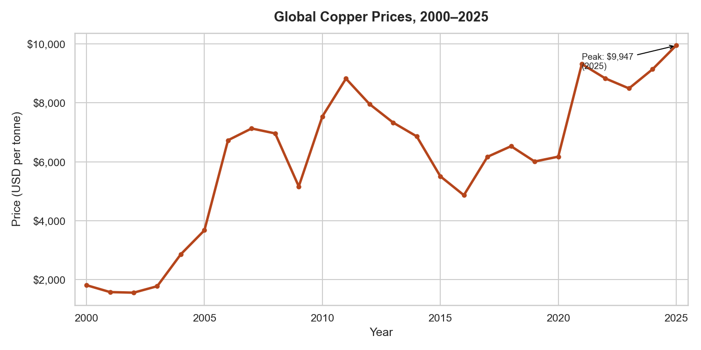
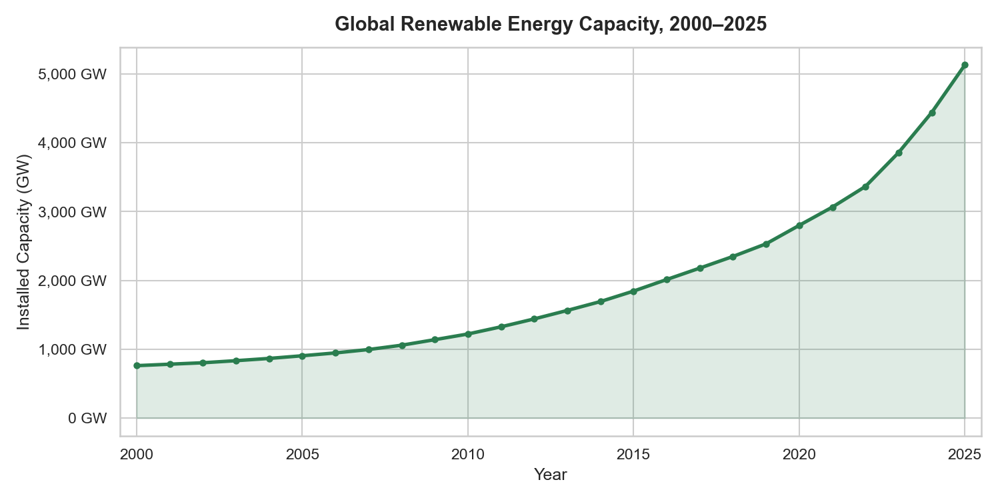
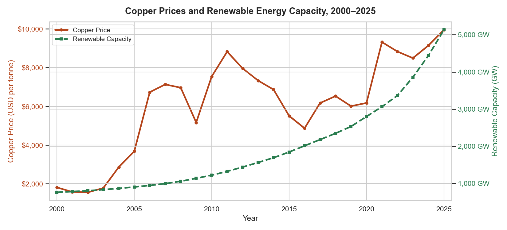
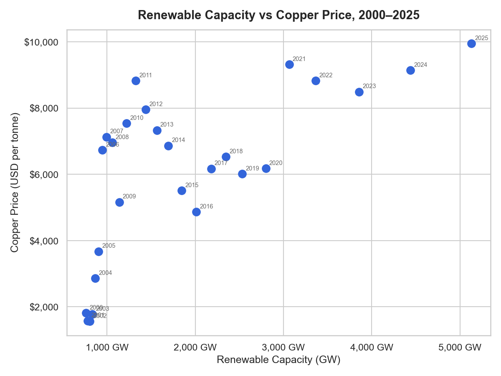
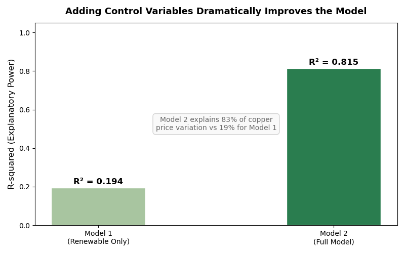
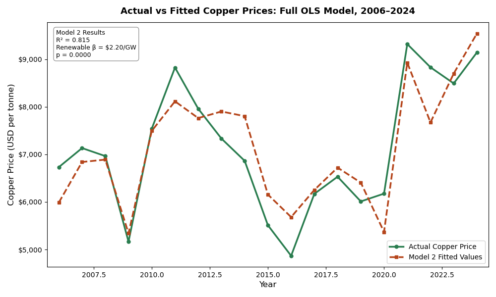

# Green Copper: Is the Clean Energy Transition Pushing Up Copper Prices?

*Using data from FRED and IRENA to ask whether the renewable energy buildout shows up in copper markets — and what else is driving prices.*

---

## Introduction

When most people think about the clean energy transition, they picture solar panels, wind turbines, and electric vehicles. They rarely picture copper — the reddish-brown metal that makes all of it possible. Solar panels, offshore wind turbines, EV batteries, and power grid upgrades all need enormous quantities of it. A single offshore wind turbine uses around 8 tonnes. An electric vehicle uses roughly four times as much copper as a conventional car.

So here is the question this post tries to answer: as global renewable energy capacity has grown, has copper actually got more expensive because of it? And if so, how much of that price rise can we pin on the green buildout once we account for other forces — like whether the world economy is booming or contracting, and whether the US dollar is strong or weak?

The analysis uses data from FRED and IRENA covering 2006 to 2024. It is not a long dataset — 19 annual observations — but it spans enough variation to say something useful.

---

## The Data

Three datasets underpin this analysis, all publicly available.

**Copper prices** come from FRED, which publishes monthly copper prices in US dollars per tonne from the IMF Primary Commodity Prices database. Monthly observations were averaged to annual figures to match the other datasets.

**Renewable energy capacity** comes from IRENA, which tracks annual global installed capacity across all renewable technologies. The figures here cover total worldwide capacity — solar, wind, hydro, geothermal, bioenergy — converted from megawatts to gigawatts.

**Control variables** also came from FRED: world GDP per capita (World Bank series) was used to compute an annual GDP growth rate, and the broad trade-weighted US dollar index (DTWEXBGS) captures currency effects on commodity prices. Copper trades in dollars globally, so a stronger dollar mechanically raises costs for non-US buyers.

The final dataset has 19 annual observations from 2006 to 2024, with no missing values. The start date is constrained by when the dollar index series becomes available.

| Variable | Source | Frequency | Unit |
|---|---|---|---|
| Copper Price | FRED / IMF | Monthly → Annual | USD per tonne |
| Renewable Capacity | IRENA | Annual | Gigawatts (GW) |
| World GDP Growth | FRED / World Bank | Annual | % change |
| US Dollar Index | FRED | Daily → Annual | Index |

---

## Copper Prices: Boom, Bust, Repeat

Copper prices have moved a lot. Prices sat below $2,000 per tonne in the early 2000s, then surged more than fourfold during the commodity boom of the mid-2000s as China industrialised rapidly.

*Figure 1: Annual average copper prices in USD per tonne, 2000–2025. Source: FRED / IMF Primary Commodity Prices.*

The peak came near $9,000 in 2011, followed by a long slide to around $4,900 in 2016 as Chinese growth slowed. Since then prices have recovered strongly, hitting close to $10,000 per tonne by 2025.

What stands out is the volatility. The 2008 crash, the 2011 peak, the 2016 trough — these swings are too sharp and too fast to be explained by renewable energy buildout alone. Something else is going on. That is exactly why the regression later in this post controls for broader economic conditions before drawing any conclusions about renewables.

---

## The Renewable Energy Buildout

Global renewable capacity has grown almost without interruption since 2000 — from 762 GW to over 5,100 GW by 2025. That is a sevenfold increase in 25 years.

*Figure 2: Global installed renewable energy capacity in gigawatts (GW), 2000–2025. Source: IRENA.*

Growth was gradual through the 2000s, mostly hydropower. The real acceleration came after 2015 as solar and wind costs collapsed. By the early 2020s, annual capacity additions were running at hundreds of gigawatts per year. At that scale, the raw material implications are hard to ignore.

---

## Do They Move Together?

Figure 3 puts both series on the same chart.

*Figure 3: Copper prices (left axis, USD per tonne) and global renewable energy capacity (right axis, GW), 2000–2025.*

Both trend upward over the period, but the relationship is messy. Copper spikes and crashes; renewable capacity just keeps climbing. The years 2012–2016 are the most telling — capacity kept growing but copper prices fell sharply. That gap is the reason this analysis goes beyond a simple trend comparison.

Figure 4 makes the year-by-year relationship explicit.

*Figure 4: Each point represents one year. Higher renewable capacity generally coincides with higher copper prices, but the relationship is noisy — particularly in 2012–2016.*

There is an upward pattern, but with real scatter. The Pearson correlation between the two variables is 0.679 — positive and moderately strong, but not overwhelming. Roughly 46% of the variation in copper prices is statistically associated with renewable capacity on its own. The rest needs explaining elsewhere.

---

## Building a Regression Model

To separate the renewable energy effect from other forces, an Ordinary Least Squares (OLS) regression was run. OLS estimates how much each variable contributes to copper prices when the others are held constant — it is the standard approach for this kind of question in economics.

Two models were compared. **Model 1** uses only renewable capacity. **Model 2** adds world GDP growth and the dollar index as controls. Oil price was tested as a fourth variable but dropped — it was statistically insignificant (p = 0.336) and correlated with GDP growth, a problem known as multicollinearity that distorts the estimates of other variables.

Figure 5 shows what happens to explanatory power when the controls are added.

*Figure 5: R-squared values for Model 1 (renewable capacity only) and Model 2 (full model). R-squared is the share of variation in copper prices the model accounts for.*

Model 1 explains 19% of copper price variation. Model 2 explains 82%. That jump is the most important number in this analysis — it shows that macroeconomic conditions, not the energy transition alone, are doing most of the work in any given year.

Figure 6 shows how closely Model 2 tracks actual prices across the 19-year period.

*Figure 6: Actual copper prices (green) versus Model 2 fitted values (red dashed), 2006–2024.*

The model picks up the 2009 crash, the 2010–2012 elevated prices, and the post-2020 surge reasonably well. The gaps — especially around 2020 — reflect things the model cannot see, like pandemic supply chain disruptions and speculative trading.

### What the Numbers Say

| Variable | Coefficient | P-value | Interpretation |
|---|---|---|---|
| Renewable Capacity | +$2.20 per GW | 0.000 | Highly significant |
| World GDP Growth | +$239 per 1% | 0.007 | Significant |
| US Dollar Index | -$158 per point | 0.000 | Highly significant |

Each additional gigawatt of global renewable capacity is associated with a $2.20 rise in copper prices per tonne, holding GDP growth and the dollar constant. Given that capacity has grown by roughly 3,500 GW since 2006, that implies a renewable-driven contribution of around $7,700 per tonne over the full period — though this estimate carries the usual caveats of a small-sample regression.

GDP growth adds $239 per tonne for each percentage point increase — the world economy booming means more copper consumed across construction, manufacturing, and infrastructure. The dollar index subtracts $158 per tonne for each index point rise, consistent with the standard commodity pricing mechanism.

---

## Limitations

The dataset has only 19 observations, which limits how much weight to put on any individual coefficient. The model captures association, not causation — there may be variables not included here, such as Chinese manufacturing output or copper mining supply disruptions, that drive both renewable investment and copper prices at the same time. The multicollinearity warning from the regression software suggests the explanatory variables are not fully independent, which may slightly inflate standard errors. And 2025 copper price data is incomplete, so the last data point in the time series figures is provisional.

---

## Conclusion

The numbers support the idea that renewable energy growth is pushing copper prices up — but it is not the main driver in any given year.

After controlling for GDP growth and the dollar, each gigawatt of new renewable capacity is associated with a $2.20 increase in copper prices. That relationship is statistically significant and survives the inclusion of macroeconomic controls. The green transition is adding real upward pressure on copper demand.

But the jump from 19% to 82% explanatory power when GDP and the dollar are added tells the more important story. Whether the world economy is expanding or shrinking, and whether the dollar is strengthening or weakening, determines far more of the copper price in any given year than the renewable buildout does.

Copper is sometimes called "Doctor Copper" because its price reflects the health of the global economy. This analysis suggests that is still true — but increasingly, it is also a green metal. The energy transition is changing the long-run demand picture for copper. The cyclical forces are just louder, for now.

---

## Data Sources

- **Copper Prices**: FRED / IMF Primary Commodity Prices. Series: PCOPPUSDM. [fred.stlouisfed.org](https://fred.stlouisfed.org/series/PCOPPUSDM)
- **Renewable Energy Capacity**: IRENA Electricity Capacity Statistics. [irena.org](https://www.irena.org/Data/Downloads/IRENASTAT)
- **World GDP per Capita**: FRED / World Bank. Series: NYGDPPCAPKDWLD. [fred.stlouisfed.org](https://fred.stlouisfed.org/series/NYGDPPCAPKDWLD)
- **US Dollar Index**: FRED Broad Trade-Weighted Dollar Index. Series: DTWEXBGS. [fred.stlouisfed.org](https://fred.stlouisfed.org/series/DTWEXBGS)

*All data downloaded April 2026. Full replication code: [github.com/ojsnart18-datascience/copper-energy-transition](https://github.com/ojsnart18-datascience/copper-energy-transition)*

